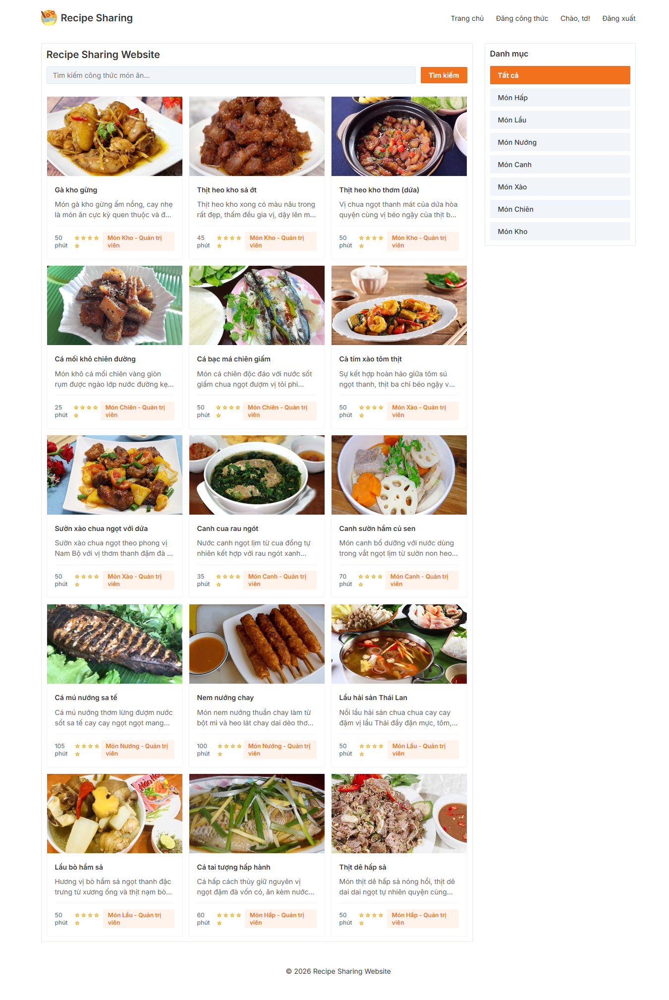
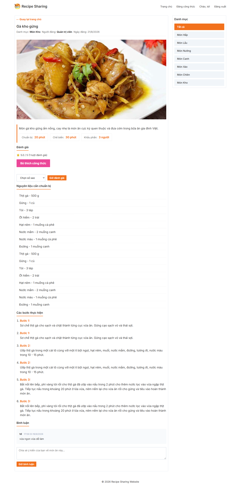
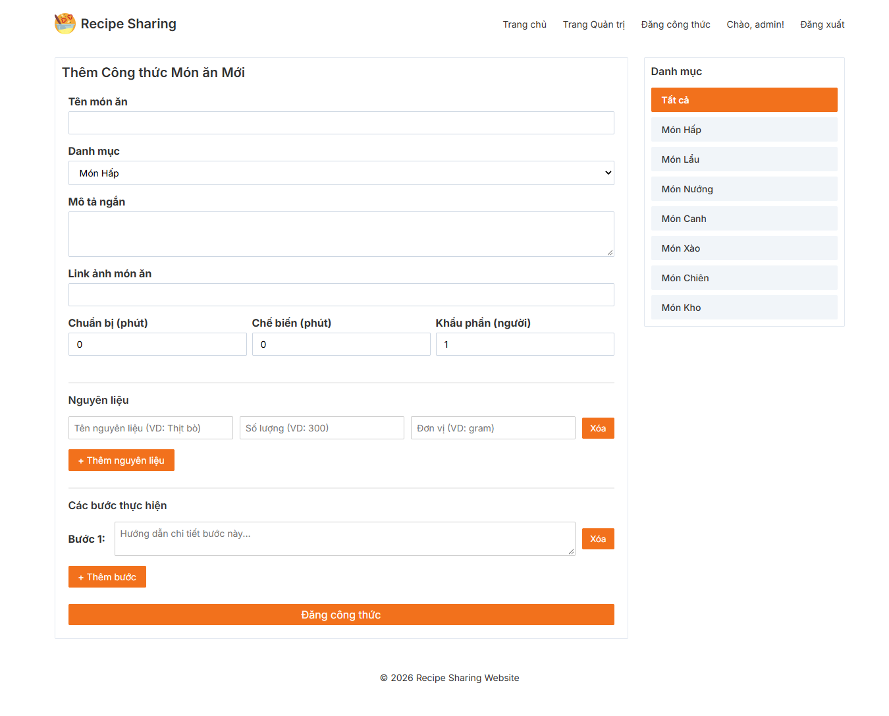
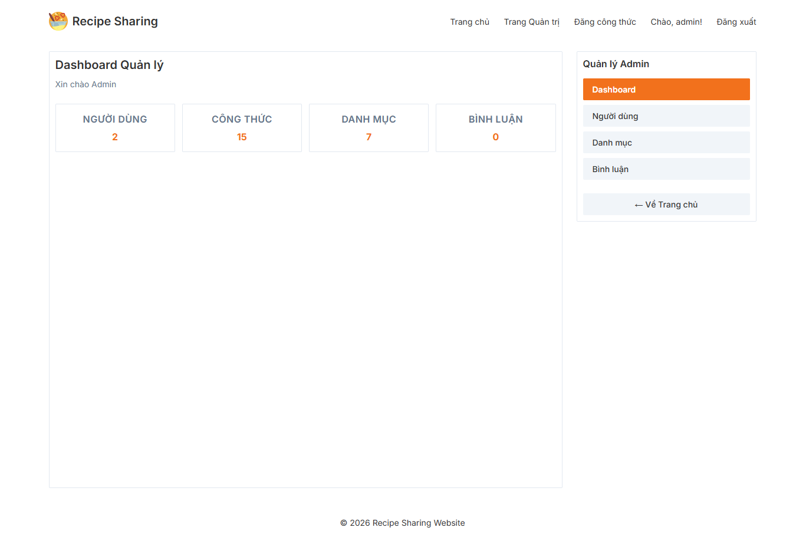
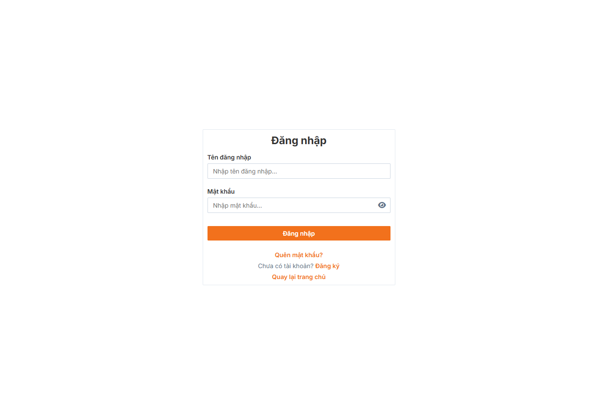
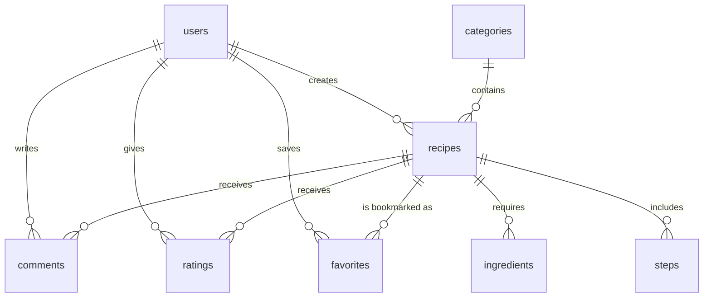

# Recipe Sharing Web

A web application for discovering, creating, and interacting with cooking recipes.

## Overview

Recipe Sharing Web is a platform where users can browse a catalog of recipes, register accounts, and publish their own cooking instructions. Users can interact with existing recipes by commenting, rating, and bookmarking their favorites. Administrators have access to a dashboard to monitor platform statistics and manage user accounts.

## Screenshots

<table align="center">
  <tr>
    <td align="center" width="50%">
      <strong>Home Page</strong><br>
      
    </td>
    <td align="center" width="50%">
      <strong>Recipe Detail Page</strong><br>
      
    </td>
  </tr>
  <tr>
    <td align="center" width="50%">
      <strong>Create Recipe Form</strong><br>
      
    </td>
    <td align="center" width="50%">
      <strong>Admin Dashboard</strong><br>
      
    </td>
  </tr>
  <tr>
    <td align="center" colspan="2">
      <strong>Login</strong><br>
      
    </td>
  </tr>
</table>

## Tech Stack

### Frontend

- EJS
- Vanilla CSS

### Backend

- Node.js
- Express.js

### Database

- MySQL
- Prisma ORM

### Authentication & Security

- bcrypt
- express-session
- express-mysql-session

### Other

- Nodemailer
- Joi

## Architecture

The application uses a layered structure that partially implements the Service-Repository pattern, separating request handling, business logic (for authentication), and data access.

- Routes: Define application endpoints.
- Controllers: Handle HTTP requests and responses.
- Services: Implement business logic.
- Repositories: Handle database access.
- Views: Render the user interface using EJS.

## Project Structure

```text
recipe-sharing-web/
├── config/
├── controllers/
├── middlewares/
├── prisma/
│   └── schema.prisma
├── public/
├── repositories/
├── routes/
├── services/
├── utils/
├── views/
├── package.json
└── README.md
```

## Requirements

- Node.js
- npm
- MySQL

## Installation

### 1. Clone the repository

```bash
git clone https://github.com/td1205/recipe-sharing-web.git
cd recipe-sharing-web
```

### 2. Install dependencies

```bash
npm install
```

### 3. Configure environment variables

Create a `.env` file in the root directory and configure the required variables (see the Environment Variables section below).

### 4. Configure the database

Ensure your MySQL server is running and matches the credentials in your `.env` file. Then, generate the Prisma Client from the existing schema:

```bash
npx prisma generate
```

_(Note: If you are connecting to an existing database without a synced schema file, use `npx prisma db pull` first)._

### 5. Start the application

```bash
npm run dev
```

## Environment Variables

| Variable             | Description                                | Required |
| -------------------- | ------------------------------------------ | -------- |
| `DATABASE_URL`       | Prisma database connection string          | Yes      |
| `DB_HOST`            | MySQL database host                        | Yes      |
| `DB_PORT`            | MySQL database port                        | Yes      |
| `DB_USER`            | MySQL database user                        | Yes      |
| `DB_PASSWORD`        | MySQL database password                    | Yes      |
| `DB_NAME`            | MySQL database name                        | Yes      |
| `SESSION_SECRET`     | Secret string for securing sessions        | Yes      |
| `EMAIL_USER`         | Email address for sending OTPs             | Yes      |
| `EMAIL_APP_PASSWORD` | Application password for the email account | Yes      |

## Database Setup

The application uses MySQL as the primary database. Prisma ORM is used for database access across the application, while direct MySQL configuration is used for session management (`express-mysql-session`). The schema includes the following entities:

- User
- Recipe
- Category
- Comment
- Rating
- Favorite
- Ingredient
- Step
- Session

### Entity-Relationship Diagram (ERD)



## Security

The application implements the following security measures:

- **Password Hashing:** Passwords are encrypted using bcrypt before being stored in the database.
- **Session Management:** Sessions are securely stored in the MySQL database using `express-mysql-session`, preventing in-memory leaks.
- **Role-based Access Control:** Middleware is used to restrict access to admin-only routes.
- **OTP Verification:** Password recovery requires a one-time password (OTP) delivered securely via email.

## Running the Application

To start the application in development mode with auto-reloading:

```bash
npm run dev
```

The application will be accessible locally at `http://localhost:3000`.

## Usage

### User

1. Register an account and log in.
2. Browse recipes on the homepage.
3. Use the navigation bar to add a new recipe with ingredients and steps.
4. Open a recipe to comment, rate, or save it to your bookmarks.
5. View and manage your created or saved recipes.

### Admin

1. Log in with an administrator account.
2. Open the Admin Dashboard from the navigation menu.
3. View platform statistics.
4. Manage users and update roles.

## Testing

Automated tests are not currently configured.

## Future Improvements

- Add automated tests
- Implement image upload functionality
- Improve recipe search and filtering
- Enhance input validation and error handling

## License

This project is licensed under the ISC License.

## Author

### Original Version

[td1205](https://github.com/td1205) - Project Lead <br>
[TuanHara](https://github.com/TuanHara) <br>
[23010710-duy](https://github.com/23010710-duy) <br>

### Version 2 — Current Development

[td1205](https://github.com/td1205) - Project Lead <br>
[TuanHara](https://github.com/TuanHara) <br>
